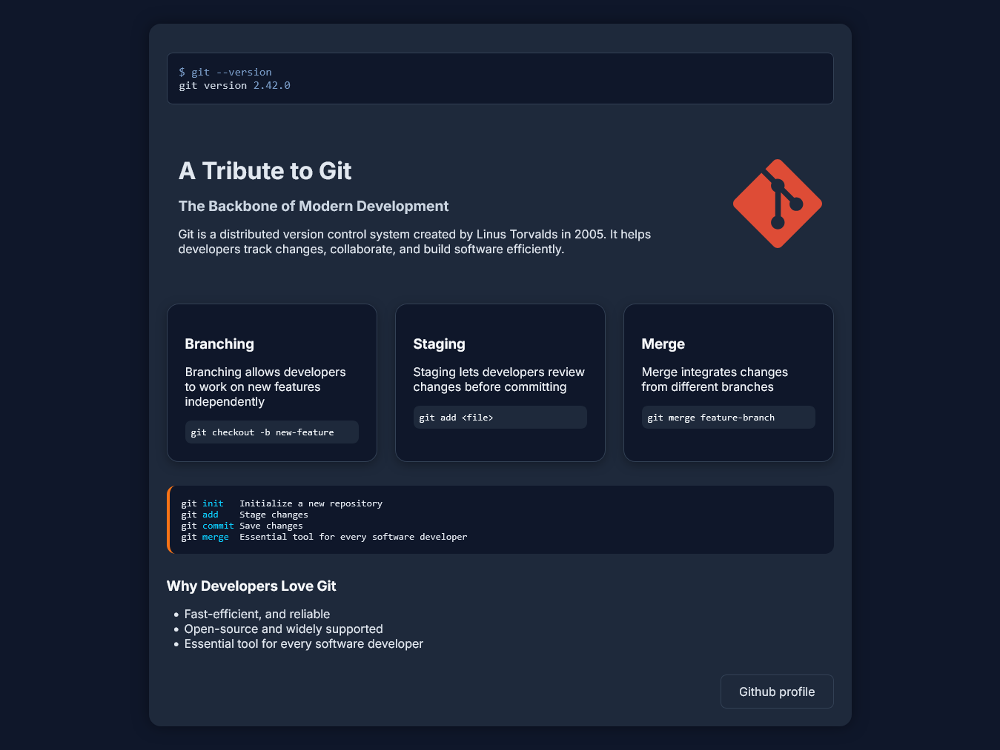

<h1 align="center">💻 Tribute to Git</h1>

<p align="center">
  A minimalist tribute page to <strong>Git</strong>, the powerful version control system.  
  Built with ❤️ using HTML and CSS.
</p>

<p align="center">
  <a href="https://github.com/zibaakord/tribute-to-git"></a>
  <a href="#"></a>
</p>

---

## 🌟 Overview

This project is a simple yet elegant **tribute page** created as part of the [freeCodeCamp](https://www.freecodecamp.org/) Responsive Web Design course. It honors **Git**, the essential tool for modern software development.

The goal was to practice semantic HTML and CSS for a clean, accessible design — no JavaScript or frameworks involved.

---

## 🛠️ Built With

| Technology | Purpose              |
|------------|----------------------|
| `HTML5`    | Markup structure     |
| `CSS3`     | Styling & layout     |
| `GitHub`   | Code hosting         |

---

## 📷 Preview



---

## 📂 Getting Started

To view the project locally:

```bash
git clone https://github.com/zibaakord/tribute-to-git.git
cd tribute-to-git
open index.html
